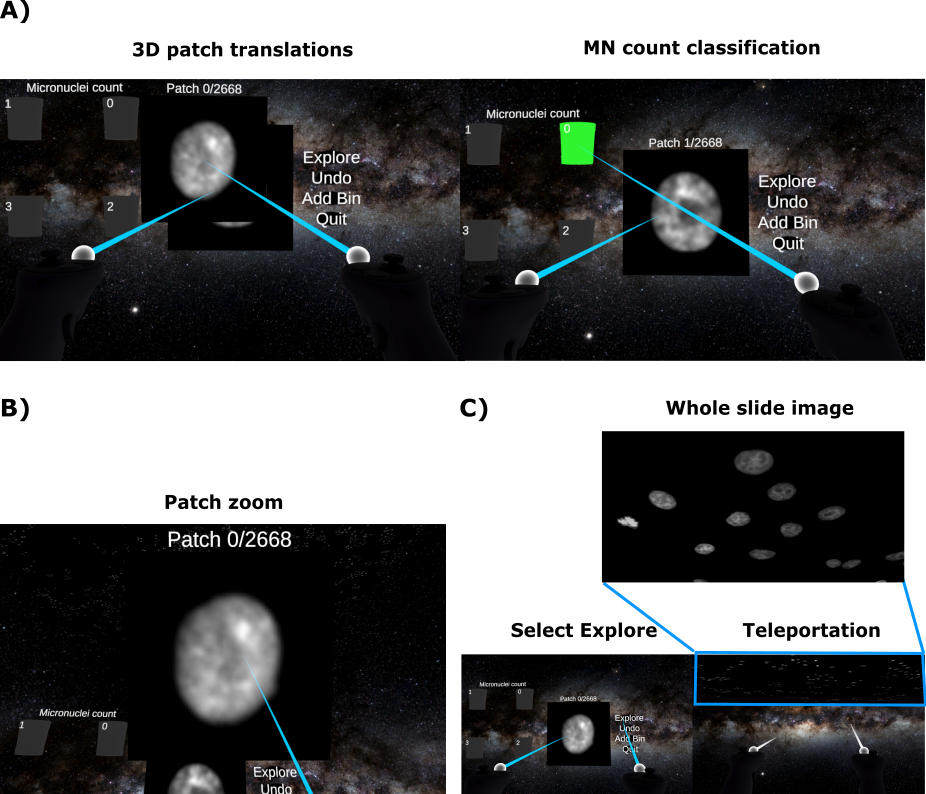

# MicronuclAI-VR

VR implementation of MicronuclAI labelling tool cited in *Ibarra-Arellano et al., 2025*.

## Game logic
The immersive user interface of micronuclAI VR is populated with classification buckets, a single nucleus patch stack, whole-well image visualization, virtual controllers and buttons. The aim is to label the MN count for individual nuclei. This is executed by the following steps: (1) inspect individual nuclei (Figure B) and (2) label MN count by placing the patch in the dedicated bucket (Figure A). Wrong labels are rectified by selecting the “Undo” button, whilst higher MN counts are accommodated by adding the corresponding buckets through selecting the “Add Bin” button. Additionally, the whole-well image from which the patches originate is visualized to enable dataset exploration at native resolution. For convenience, an “Explore” button is provided to teleport the user to the whole-well image (Figure C). Once sufficient nuclei have been classified, the user quits the software to exit and generate a summarisation CSV file containing the recorded nuclei mask id, MN count and file path.

During the process of bucketing, the user is reminded of their decision through green illumination of the bucket when the patch intersects with the bucket bounds (Figure A). It enables the user to confirm their decision before committing to it. Nevertheless, wrong classifications are inevitable, therefore we provided a reverse button that undoes the bucketing by reappearing the bucketed patch on the front of the patch stack and deleting its assigned MIN count from memory. 

